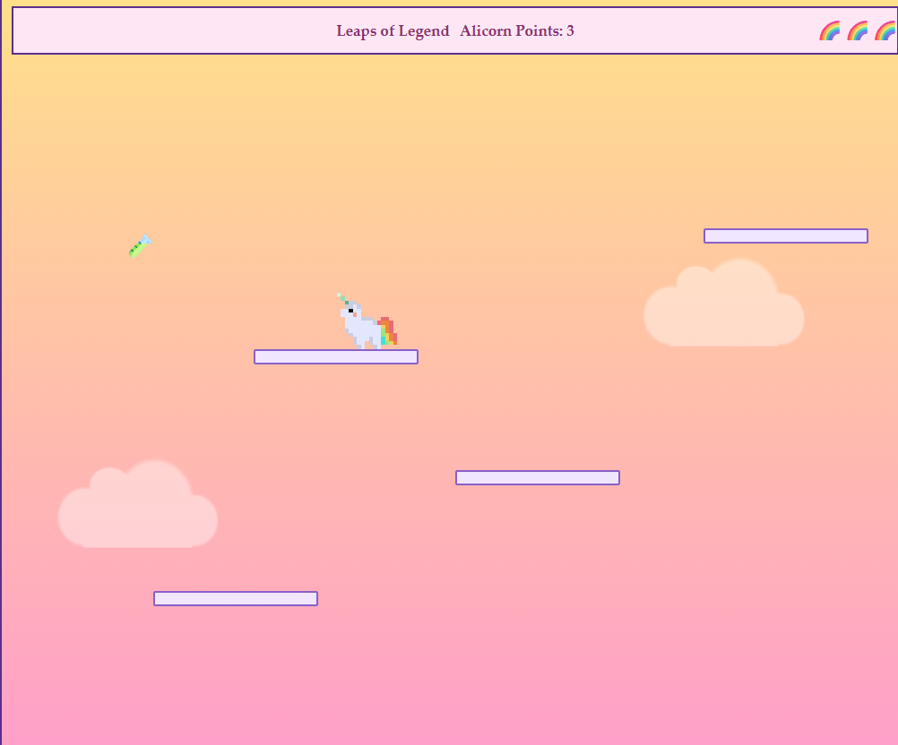

# Leaps of Legend: 2026 Hackathon

A browser game built for [js13kGames](https://js13kgames.com/), a web game development competition with a strict 13KB size limit.

The 2026 jam runs from **13 August 13:00 CEST to 13 September 13:00 CEST**. This year's theme is **Unicorns and Rainbows**.

## Screenshots

### In Game



### Menu


## Play

Open `src/index.html` in a browser. No build step is required to play locally.

### How to Play

- Use the **Left** and **Right Arrow** keys to move.
- Press the **Up Arrow** to jump.
- Land on platforms to climb higher and earn points.
- Some platforms move, so time your jumps carefully.
- You have **three rainbows**, which act as your lives. Lose them all and it's game over.
- Press **Shift** to activate the special ability. This means the unicorn's position won't affect you, but using it will **take away some of your score**.
- Your goal is to reach the princess and rescue her.
- The unicorn must give the princess **15 Alicorn Points** to save her and complete the game.

### The Goal

Guide the unicorn through the level, collect enough **Alicorn Points**, and reach the princess. Once you have **15 Alicorn Points**, reach the princess to rescue her and win the game.

## Development

Built on the [js13k-toolkit](https://github.com/lucaspenney/js13k-toolkit) starter, which uses Gulp to bundle the game and check the final size against the 13KB limit.

```bash
npx gulp build   # bundle and check size against the 13KB limit
npx gulp watch   # rebuild on file changes during development
```

## Assets

- Unicorn sprite: [rcxno's pixel art unicorn](https://rcxno.itch.io/pixel-art-unicorn)
- Princess sprite: [Princess artwork](https://opengameart.org/content/adventurous-princess)

## Credits

Starter repo: [lucaspenney/js13k-toolkit](https://github.com/lucaspenney/js13k-toolkit)