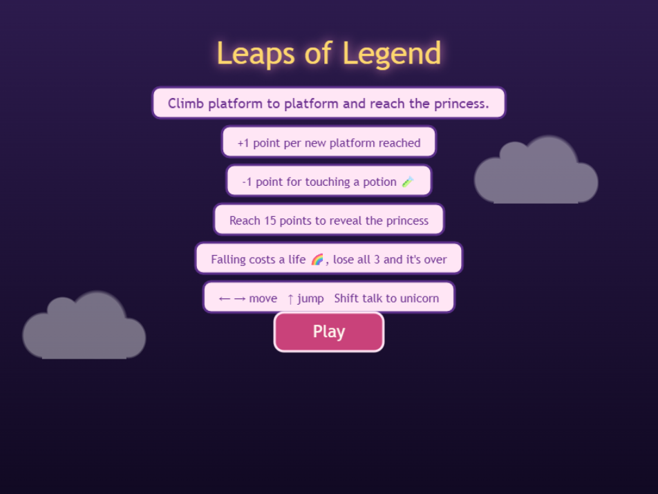

# Leaps of Legend game 2026 Hackerthon 

A browser game built for [js13kGames](https://js13kgames.com/), a web game development
competition with a strict 13KB size limit. The 2026 jam runs 13 August 13:00 CEST to
13 September 13:00 CEST. This year's theme: **Unicorns and Rainbows**.

## Screenshots

### In Game


### Menu


## Play

Open `src/index.html` in a browser. No build step is required to play locally.

### How to play:

Arrow keys move left and right
Up arrow jumps
Land on platforms to climb and earn points
Some platforms move, so time your jumps
Three rainbows are your lives. Lose them all and it is game over

## Development

Built on the [js13k-toolkit](https://github.com/lucaspenney/js13k-toolkit) starter, which
uses gulp to bundle and check the final size against the 13KB limit.

```bash
npx gulp build   # bundle and check size against the 13KB limit
npx gulp watch   # rebuild on file changes during development
```

## Assets

- Unicorn sprite: [rcxno's pixel art unicorn](https://rcxno.itch.io/pixel-art-unicorn)
- Princess sprite: [princess artwork](https://opengameart.org/content/adventurous-princess)

## Credits

Starter repo: [lucaspenney/js13k-toolkit](https://github.com/lucaspenney/js13k-toolkit)